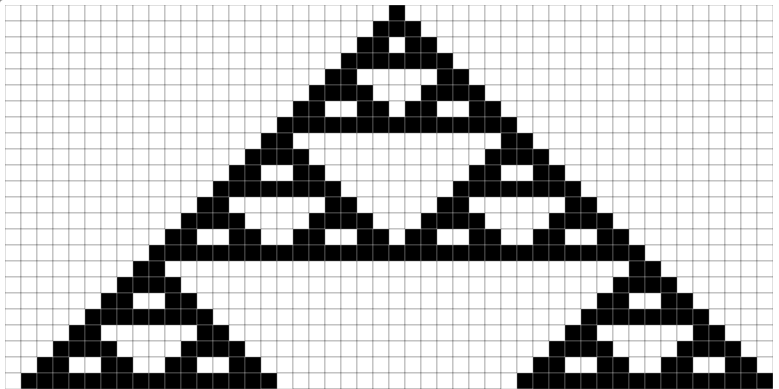
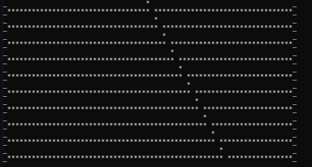

# 1D-Elementary-Cellular-Automata
Programa para generación de las 256 reglas de los autómatas de 1D. 

# ¿Qué es un autómata celular de 1D? 

    Un autómata celular es un modelo matemático para un sistema dinámico compuesto por un conjunto de celdas o células que adquieren distintos estados o valores. 
    Estos estados son alterados de un instante a otro en unidades de tiempo discreto, es decir, que se puede cuantificar con valores enteros a intervalos regulares.
     De esta manera este conjunto de células logran una evolución según una determinada expresión matemática, que es sensible a los estados de las células vecinas,
      y que se conoce como regla de transición local.

  

 Ejemplo de regla 126 

# Captura del código. 

  

 Ejemplo de regla 94, desde cmd. 

<a href = "https://elife-asu.github.io/wss-modules/modules/1-1d-cellular-automata/"> Generador online. </a> :computer:
